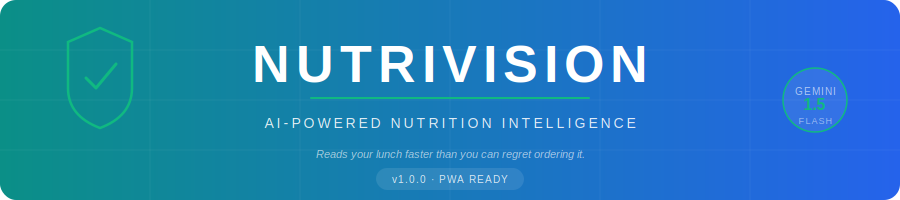
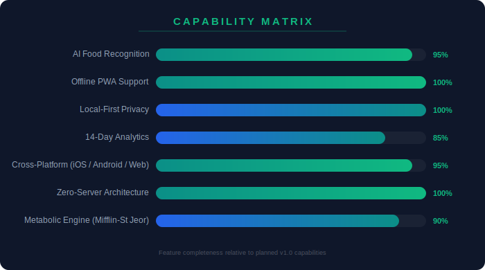
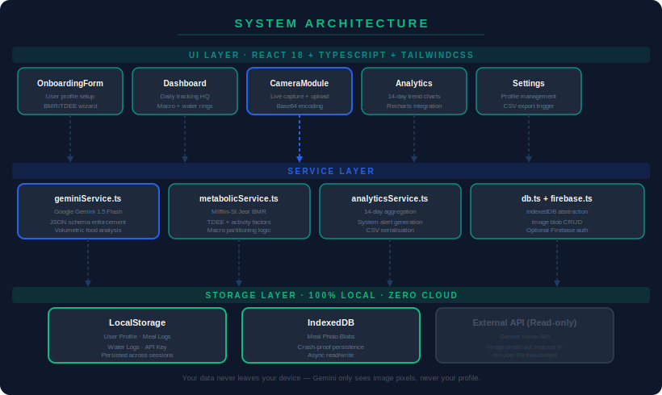
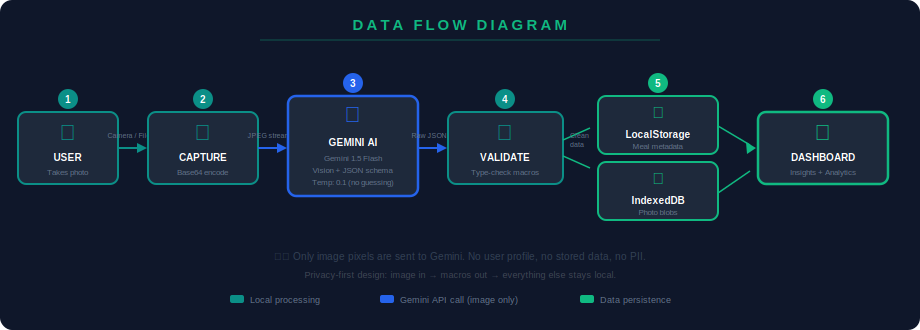
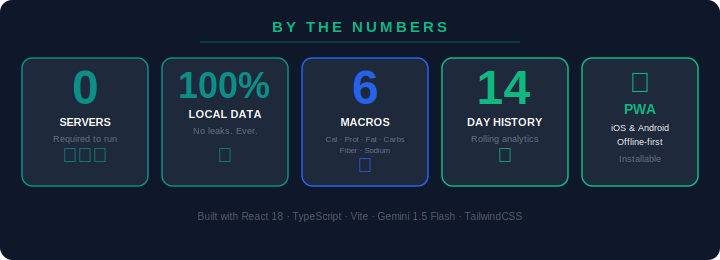

<div align="center">



<br/>

# NutriVision

**AI-Powered Nutrition Intelligence — No Cloud. No Spying. No Skynet. Relax.**

<br/>


</div>

---

## 🧬 What Is This Thing?

**NutriVision** is an AI-powered nutrition tracking Progressive Web App that does one thing your gym bro can't: it actually *looks* at your food and gives you the numbers.

Point your camera at a plate of pasta, a suspicious gas-station burrito, or a salad you're pretending is a meal — and Gemini AI will decompose it volumetrically, estimate weights, and spit back calories, protein, fat, carbs, fiber, and sodium. Faster than you can say "but it's a small portion."

Built on a **zero-server architecture**: your meal history, photos, and profile live entirely on *your* device. We don't want your data. We are, in fact, allergic to it.


---

## 🔭 System Overview

| Capability | Detail |
|---|---|
| 🤖 **AI Engine** | Google Gemini 1.5 Flash — vision model, JSON schema enforced |
| 🧮 **Metabolic Math** | Mifflin-St Jeor BMR + TDEE with 5 activity tiers |
| 💾 **Storage** | LocalStorage (metadata) + IndexedDB (photos) — 100% local |
| 📱 **Platform** | PWA — installable on iOS, Android, desktop |
| 📊 **Analytics** | 14-day rolling trend analysis + system alerts |
| 🔐 **Privacy** | Zero backend, zero cloud sync, zero trust required |
| 📤 **Export** | CSV download for spreadsheet enthusiasts (we see you) |

---

## ⚙️ Features

### 🤖 AI Food Recognition
NutriVision sends your meal photo to Google Gemini 1.5 Flash and asks it to act as a quantitative dietitian. The model performs *volumetric plate decomposition* — it identifies each food component, estimates its density and weight, then maps that to macro/micronutrient data. The model outputs strict JSON (temperature: 0.1, schema-enforced), so there's no nutrition poetry — just numbers.

Every analysis includes an **±20% uncertainty range** because even a vision model can't tell the difference between a 200g chicken breast and a 300g one from a top-down JPEG. Trust it, but verify with your scale if you're that serious.

### 🧮 The Metabolic Engine
We run **Mifflin-St Jeor** (the gold standard since 1990):

```
BMR (men)   = 10×weight(kg) + 6.25×height(cm) − 5×age + 5
BMR (women) = 10×weight(kg) + 6.25×height(cm) − 5×age − 161
TDEE        = BMR × activity_factor
```

Activity factors range from `1.2` (sedentary / desk job) to `1.9` (extremely active / professional athlete or someone who lies about their step count).

**Hydration targeting** uses `35ml/kg` base + `~500ml` per activity tier above sedentary. Much smarter than "drink 8 glasses."

**Macro partitioning**:
- Protein: `1.8g/kg` bodyweight — protect the muscle
- Fat: `0.8g/kg` — hormonal baseline (so you remain a functional human)
- Carbs: whatever's left — *earn them*

### 📱 Progressive Web App
Install it on your phone like a native app. Works offline once cached. The service worker caches all static assets so the app loads even when your Wi-Fi is judging you.

### 📸 Persistent Meal Photos
Meal images are stored in **IndexedDB** as Blob objects — not in LocalStorage (which has a 5MB limit and would cry). This means your photo evidence survives browser restarts without eating your RAM.

### 📊 14-Day Analytics
Charts powered by Recharts showing calorie trends, macro breakdowns, and hydration patterns over the last 14 days. Includes **system alerts** that surface things like:
- ⚠️ Protein deficiency detected
- ⚠️ Caloric surplus critical
- ✅ Hydration target met

### 📤 CSV Export
One click and your entire meal history downloads as a `.csv` file. For pivot-table people. We don't judge.

---

## 📊 Capability Matrix

<div align="center">
<br/>

<br/><br/>
</div>

---

## 🏗️ Architecture

<div align="center">
<br/>

<br/><br/>
</div>

The app follows a clean 3-layer architecture:

**UI Layer** (`src/components/`) — React 18 components with TailwindCSS. Stateless where possible, lifting state up to `App.tsx` which acts as the single source of truth.

**Service Layer** (`src/services/`) — Pure TypeScript modules. No classes, no singletons. Just functions that take data and return data:
- `geminiService.ts` — Talks to Gemini API, enforces JSON schema
- `metabolicService.ts` — BMR/TDEE/macro calculations
- `analyticsService.ts` — Aggregation, trend detection, CSV serialisation
- `db.ts` — IndexedDB abstraction for image blobs

**Storage Layer** — LocalStorage holds JSON-serializable data (profiles, meal logs, water logs). IndexedDB holds binary image data. Neither is accessible to any server, ever.

---

## 🔄 Data Flow

<div align="center">
<br/>

<br/><br/>
</div>

**The journey of your burrito:**
1. You take a photo (or upload one)
2. The `CameraModule` captures it and Base64-encodes it
3. `geminiService.ts` sends the image bytes to Gemini 1.5 Flash with a strict prompt and JSON response schema
4. The model returns macro data; we validate and type-check it
5. Metadata goes to LocalStorage; the image blob goes to IndexedDB
6. The Dashboard and Analytics components read from storage and show you the damage

---

## 🚀 Installation

### Prerequisites
- Node.js ≥ 18
- A [Google AI Studio](https://aistudio.google.com/) API key (free tier works fine)

### Quick Start

```bash
# 1. Clone the repo
git clone https://github.com/Kaelith69/NutriVision.git
cd NutriVision

# 2. Install dependencies
npm install

# 3. Set your API key (the app will also ask for it at first launch)
echo "VITE_GEMINI_API_KEY=your_key_here" > .env

# 4. Fire it up
npm run dev
```

Open `http://localhost:5173` and complete the onboarding form. That's it.

### Production Build

```bash
npm run build
npm run preview   # test the production build locally
```

### Deploy in 30 Seconds (Surge.sh)

```bash
./deploy_online.sh   # builds + deploys to a public surge.sh URL
```

### Other Deployment Options

| Platform | Method |
|---|---|
| **Vercel** | Connect repo → auto-deploys on push |
| **Netlify** | Connect repo → `netlify.toml` already configured |
| **Firebase** | `npm install -g firebase-tools` → `firebase deploy` |
| **GitHub Pages** | Push to `main` → `.github/workflows/production.yml` handles it |

> ⚠️ **Don't forget** to set `VITE_GEMINI_API_KEY` in your hosting provider's environment variables dashboard. That blank screen you'll get otherwise? That's the app quietly judging you.

---

## 📖 Usage

### First Launch — Onboarding
Fill in your age, sex, height, weight, and activity level. NutriVision calculates your BMR, TDEE, and daily macro targets on the spot. You can change these any time in **Settings**.

### Logging a Meal
1. On the Dashboard, tap the **camera / upload button**
2. Take a photo or select from your gallery
3. (Optional) add a scale context like "standard dinner plate" to help the AI
4. Hit **Analyse** — Gemini 1.5 Flash processes the image in ~2 seconds
5. Review the detected items, correct anything if needed, then **Save**

### Logging Water
Tap the water intake widget on the Dashboard. Tap the `+250ml` / `+500ml` quick-add buttons, or enter a custom amount.

### Analytics
Navigate to the **Analytics** tab to see 14-day trend charts, macro breakdowns, and any active system alerts.

### Exporting Data
In the header, tap the **Export** button to download your full meal history as a `.csv` file. Works great with Excel, Google Sheets, or whatever makes you happy.

---

## 📁 Project Structure

```
nutrivision/
├── src/
│   ├── App.tsx                    # Root component, state management
│   ├── index.tsx                  # Entry point
│   ├── types.ts                   # TypeScript interfaces & enums
│   ├── constants.ts               # App-wide constants
│   ├── index.css                  # Global styles
│   ├── components/
│   │   ├── Dashboard.tsx          # Main daily tracking view
│   │   ├── CameraModule.tsx       # Image capture + Gemini integration
│   │   ├── Analytics.tsx          # 14-day charts & alerts
│   │   ├── OnboardingForm.tsx     # First-run profile setup
│   │   ├── Settings.tsx           # Profile editing + data reset
│   │   ├── Layout.tsx             # App shell (nav, header)
│   │   ├── MealDetailModal.tsx    # Meal log inspection + editing
│   │   └── ui/                    # Reusable UI primitives
│   ├── services/
│   │   ├── geminiService.ts       # Gemini AI Vision API client
│   │   ├── metabolicService.ts    # BMR/TDEE/macro calculations
│   │   ├── analyticsService.ts    # Trend analysis + CSV export
│   │   ├── db.ts                  # IndexedDB image blob store
│   │   └── firebase.ts            # Optional Firebase auth
│   └── utils/
│       └── dateUtils.ts           # Local date helpers
├── public/                        # Static assets, PWA icons
├── docs/assets/                   # Documentation SVGs
├── .github/workflows/             # CI/CD pipelines
├── vite.config.ts                 # Vite + PWA plugin config
├── tailwind.config.js             # TailwindCSS config
├── tsconfig.json                  # TypeScript config
└── package.json
```

---

## 📈 Stats

<div align="center">
<br/>

<br/><br/>
</div>

---

## 🔐 Privacy

NutriVision was designed from day one with a **zero-trust, zero-server** philosophy.

| What | Where | Leaves device? |
|---|---|---|
| User profile | LocalStorage | ❌ Never |
| Meal logs (metadata) | LocalStorage | ❌ Never |
| Meal photos | IndexedDB | ❌ Never |
| Water logs | LocalStorage | ❌ Never |
| Gemini API key | LocalStorage | ⚠️ Sent to Google's API only |
| **Food images** | Transmitted to Gemini API during analysis | ⚠️ Image pixels only — no user data attached |

The only data that leaves your device is the **raw image pixels** sent to Google Gemini for food analysis. Your profile, meal history, and photos are never transmitted, logged, or seen by anyone — including us. We don't have a backend to receive them even if we wanted to.

See [SECURITY.md](SECURITY.md) for vulnerability reporting.

---

## 🗺️ Roadmap

| Version | Feature |
|---|---|
| **v1.1** | Barcode scanner for packaged foods |
| **v1.2** | Custom food database (manual entries) |
| **v1.3** | Multi-day meal planning |
| **v1.4** | Apple Health / Google Fit integration |
| **v2.0** | Optional cloud sync (opt-in, E2E encrypted) |

See [wiki/Roadmap.md](wiki/Roadmap.md) for the full roadmap with acceptance criteria.

---

## ⚠️ Known Issues

- **The Honesty Bug**: The app cannot prevent you from deleting that donut from the log. That's a hardware issue (you).
- **Time Zone Quirk**: Water logs are keyed by local date. If you fly across the world at midnight, your hydration log might look like you teleported. You did. It's fine.
- **Blank Screen on Deploy**: You forgot to set `VITE_GEMINI_API_KEY` in your hosting provider's environment variables. Classic.

---

## 📜 License

MIT — see [LICENSE](LICENSE) for details. Use it, fork it, build something cool. Just don't blame us if you get unreasonably shredded.

---

<div align="center">
<br/>

*Built by humans. Analysed by AI. Judged by your macros.*

<br/>
</div>
