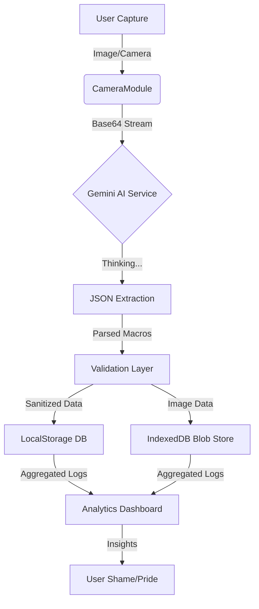

# 🛡️ NUTRI-VISION: TACTICAL METABOLIC INTELLIGENCE

> **"Because guessing your macros is for civilians."**


## 📡 Mission Briefing

Welcome to **NutriVision**, the only nutrition tracker that treats your lunch like a high-stakes tactical operation. Tired of cute fruit icons and encouraging pats on the back? We offer **cold, hard data**, military-grade interfaces, and a judgemental AI that knows exactly how many calories were in that "cheat meal."

This isn't just a calorie counter; it's a **Bio-Analysis Platform** designed to optimize your organic chassis for peak performance.

---

## 🧠 The Brains (Logic & Science)

We don't use random number generators. We use **Science™**.

### 1. Metabolic Calculations
We employ the **Mifflin-St Jeor Equation**, widely considered the "AK-47 of metabolic formulas"—reliable, robust, and effective for most humans.

$$
P = 10m + 6.25h - 5a + s
$$

*   **BMR (Basal Metabolic Rate)**: The energy you burn just existing (staring at the wall, regretting pizza).
*   **TDEE (Total Daily Energy Expenditure)**: Your BMR multiplied by an **Activity Factor** ranging from *Sedentary* (1.2) to *Extremely Active* (1.9).

### 2. The "Hydro-Lock" Algorithm
Dehydration is the enemy of performance. Our dynamic water target logic isn't "drink 8 glasses."
*   **Base**: 35ml per kg of bodyweight.
*   **Activity Modifier**: We add ~500ml for every tier of activity above "couch potato."
*   **Result**: A hydration target that actually makes sense for your physiology.

### 3. Macro Partitioning (The Protein Protocol)
*   **Protein**: Hard-locked to **1.8g/kg**. Why? Because muscle is expensive to build and cheap to lose. We protect the asset.
*   **Fat**: Set to **0.8g/kg** for hormonal baseline (so you don't cry during movies).
*   **Carbs**: The rest of your energy budget. Earn them.

---

## 🤖 The AI (Google Gemini 1.5 Flash)

We utilize the **Google Gemini 1.5 Flash** model via the Generative AI SDK for rapid, low-latency identification.

*   **Visual Recognition**: We don't just "see" food. We decompose the plate volumetrically.
*   **Context Awareness**: The AI understands "a slice of pizza" vs "a WHOLE pizza."
*   **JSON Schema Enforcement**: The AI is forced to output strict JSON data. No hallucinations, no poetry—just macros.

**Accuracy Level**: *High*. But trust, then verify. The AI gives you an **Uncertainty Range** (±20%) because even Skynet makes mistakes.

---

## 🔄 Dataflow Architecture

How your burger becomes data:



### 🔐 Zero-Server Architecture (Privacy First)
We don't want your data. In fact, we're scared of it.
*   **Metadata** lives in `LocalStorage`.
*   **Heavy Assets (Images)** live in `IndexedDB` (Crash-proof persistence).
*   **No Backend**. No cloud database.

---

## 🛠️ Features (The Arsenal)

### 📲 Mobile Field Ready (PWA)
Installable on iOS and Android. Works offline.
*   **Stealth Navigation**: Hidden hamburger menu on mobile to maximize tactical dashboard real estate.
*   **Service Workers**: Caches assets so the app loads faster than you can say "is this gluten-free?"
*   **Tactical Icon**: A shield logo that looks cool next to your banking apps.

### 📸 Persistent Visual Evidence
*   **IndexedDB Storage**: We store your meal photos locally without bloating your browser memory.
*   **Proof of Consumption**: Your logs keep the receipts.

### 📊 Analytics & Insights
*   **14-Day Trend Analysis**: See if you're actually losing weight or just fluctuating water.
*   **System Alerts**: "⚠️ Protein deficiency detected." "⚠️ Caloric surplus critical."
*   **CSV Export**: Download your data to Excel and make pivot tables, you nerd.

---

## 🚀 Deployment

We provide multiple deployment vectors. Choose your insertion point.

### Option 1: Instant Strike (Surge.sh)
Deploy in 30 seconds to a free public URL.
```bash
./deploy_online.sh
```

### Option 2: Local Base (Development)
1.  **Clone & Install**:
    ```bash
    git clone https://github.com/your-username/nutrivision.git
    cd nutrivision
    npm install
    ```
2.  **Arm the System**:
    Create `.env`: `VITE_GEMINI_API_KEY=your_key`
3.  **Launch**:
    ```bash
    npm run dev
    ```

### Option 3: Permanent Forward Operating Base
*   **GitHub Pages**: Push to `main`. The included workflow (`.github/workflows/production.yml`) handles the rest.
*   **Firebase**: `npm install -g firebase-tools` -> `firebase deploy`.
*   **Vercel / Netlify**: Connect your repo and it just works (Configs included).

---

## ⚠️ Known Issues
*   **The "Honesty" Bug**: The app cannot prevent you from lying about that donut. That's a hardware issue (you).
*   **Time Travel**: If you fly across the world, your water logs might look weird for a day. We calculate based on *your* generic local day, not UTC.
*   **Blank Screen**: If you see a blank screen on deployment, ensure your `.env` variables are set correctly in your hosting provider's dashboard.

---

## 📜 The "Tactical" License

See `LICENSE` file. Spoiler: Use it, break it, fix it. Just don't blame us if you get shredded.

---

*> End of Briefing. Dismissed.*
