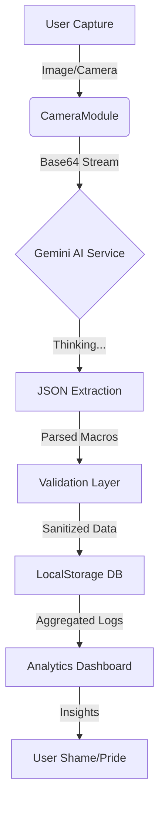

# 🛡️ NUTRI-VISION: TACTICAL METABOLIC INTELLIGENCE

> **"Because guessing your macros is for civilians."**

[](https://kaelith69.github.io/NutriVision/)


<div align="center">

### 🌐 [**LAUNCH APPLICATION**](https://kaelith69.github.io/NutriVision/) 🌐

**Live Deployment Status: ACTIVE** | **All Systems: GO**

</div>

---

## 📑 Table of Contents

- [Mission Briefing](#-mission-briefing)
- [The Brains (Logic & Science)](#-the-brains-logic--science)
- [The AI (Google Gemini 1.5)](#-the-ai-google-gemini-15)
- [Dataflow Architecture](#-dataflow-architecture)
- [Features (The Arsenal)](#️-features-the-arsenal)
- [Deployment](#-deployment)
- [Known Issues](#️-known-issues)
- [Contributing](#-contributing)
- [The "Tactical" License](#-the-tactical-license)

## 📡 Mission Briefing

Welcome to **NutriVision**, the only nutrition tracker that treats your lunch like a high-stakes tactical operation. Tired of cute fruit icons and encouraging pats on the back? We offer **cold, hard data**, military-grade interfaces, and a judgemental AI that knows exactly how many calories were in that "cheat meal."

This isn't just a calorie counter; it's a **Bio-Analysis Platform** designed to optimize your organic chassis for peak performance.

### 🎯 Core Capabilities
- 📸 **Visual Food Recognition**: Point, shoot, analyze. AI-powered macro extraction from images.
- 📊 **Real-Time Analytics**: 14-day trend tracking with predictive insights.
- 💧 **Dynamic Hydration Targets**: Science-based water intake calculations.
- 🔒 **Zero-Server Architecture**: Your data stays yours. No cloud, no tracking, no compromise.
- 📱 **Mobile PWA**: Install once, run anywhere. Offline-capable field deployment.
- 🌙 **Tactical Dark Mode**: Because operators don't use light themes.

---

## 🧠 The Brains (Logic & Science)

We don't use random number generators. We use **Science™**.

### 1. Metabolic Calculations
We employ the **Mifflin-St Jeor Equation**, widely considered the "AK-47 of metabolic formulas"—reliable, robust, and effective for most humans.

$$
P = 10m + 6.25h - 5a + s
$$

*   **BMR (Basal Metabolic Rate)**: The energy you burn just existing (staring at the wall, regretting pizza).
*   **TDEE (Total Daily Energy Expenditure)**: Your BMR multiplied by an **Activity Factor** ranging from *Sedentary* (1.2) to *Extremely Active* (1.9).

### 2. The "Hydro-Lock" Algorithm
Dehydration is the enemy of performance. Our dynamic water target logic isn't "drink 8 glasses."
*   **Base**: 35ml per kg of bodyweight.
*   **Activity Modifier**: We add ~500ml for every tier of activity above "couch potato."
*   *Result*: A hydration target that actually makes sense for your physiology.

### 3. Macro Partitioning (The Protein Protocol)
*   **Protein**: Hard-locked to **1.8g/kg**. Why? Because muscle is expensive to build and cheap to lose. We protect the asset.
*   **Fat**: Set to **0.8g/kg** for hormonal baseline (so you don't cry during movies).
*   **Carbs**: The rest of your energy budget. Earn them.

---

## 🤖 The AI (Google Gemini 1.5)

We utilize the **Google Gemini 1.5** model via the Generative AI SDK.

*   **Visual Recognition**: We don't just "see" food. We decompose the plate volumetrically.
*   **Context Awareness**: The AI understands "a slice of pizza" vs "a WHOLE pizza."
*   **JSON Schema Enforcement**: The AI is forced to output strict JSON data. No hallucinations, no poetry—just macros.

**Accuracy Level**: *High*. But trust, then verify. The AI gives you an **Uncertainty Range** (±20%) because even Skynet makes mistakes.

---

## 🔄 Dataflow Architecture

How your burger becomes data:



### 🔐 Zero-Server Architecture (Privacy First)
We don't want your data. In fact, we're scared of it.
*   **All Data** lives in your browser's `LocalStorage`. Nothing leaves your device.
*   **No Backend**. No cloud database. No third-party tracking.
*   **Crash Proofing**: We strictly *do not* save heavy images to storage (that crashes apps). We only save the metadata.
*   **You're in Control**: Clear your data anytime. Export it whenever you want. It's yours.

---

## 🛠️ Features (The Arsenal)

### 📲 Mobile PWA (Field Ready)
Installable on iOS and Android. Works offline. Optimized for touch interfaces.
*   **Service Workers**: Caches assets so the app loads faster than you can say "is this gluten-free?"
*   **Tactical Icon**: A shield logo that looks cool next to your banking apps.
*   **Responsive Design**: Adapts from phone screens to desktop monitors seamlessly.

### 📊 Analytics & Insights
*   **14-Day Trend Analysis**: See if you're actually losing weight or just fluctuating water.
*   **System Alerts**: "⚠️ Protein deficiency detected." "⚠️ Caloric surplus critical."
*   **CSV Export**: Download your data to Excel and make pivot tables, you nerd.
*   **Visual Dashboards**: Charts and graphs that make data actually mean something.

### 🎨 Tactical UI System
*   **Dark Mode Only**: Because light attracts enemies (and eye strain).
*   **Monospace Data**: For that "hacker mainframe" aesthetic.
*   **Haptic Feedback (Visual)**: Buttons that feel distinct and provide clear interaction feedback.
*   **Intuitive Navigation**: Streamlined interface that puts critical data front and center.

---

## 🚀 Deployment

### Quick Start (Local Mission)

#### Prerequisites
*   **Node.js 18+** (The engine)
*   **A Google Gemini API Key** (The ammunition) - [Get one here](https://aistudio.google.com/app/apikey)

#### Installation Steps

1.  **Clone the Repo**:
    ```bash
    git clone https://github.com/Kaelith69/NutriVision.git
    cd NutriVision
    ```

2.  **Install Dependencies**:
    ```bash
    npm install
    ```

3.  **Configure Environment**:
    Create a `.env` file in the root directory:
    ```env
    VITE_GEMINI_API_KEY=your_gemini_api_key_here
    ```

4.  **Launch Development Server**:
    ```bash
    npm run dev
    ```
    The application will be available at `http://localhost:5173`

5.  **Build for Production**:
    ```bash
    npm run build
    ```
    Production files will be generated in the `dist/` directory.

6.  **Preview Production Build**:
    ```bash
    npm run preview
    ```

### 🌐 Live Deployment

**Official Deployment**: [https://kaelith69.github.io/NutriVision/](https://kaelith69.github.io/NutriVision/)

The application is deployed via GitHub Pages with automatic updates on every push to the main branch.

---

## ⚠️ Known Issues

*   **The "Honesty" Bug**: The app cannot prevent you from lying about that donut. That's a hardware issue (you).
*   **Time Travel**: If you fly across the world, your water logs might look weird for a day. We calculate based on *your* generic local day, not UTC.
*   **Browser Compatibility**: Optimized for modern browsers (Chrome, Firefox, Safari, Edge). IE11 has reached end-of-life and is no longer supported.

---

## 🤝 Contributing

Found a bug? Want to add a feature? Contributions are welcome!

1. Fork the repository
2. Create your feature branch (`git checkout -b feature/AmazingFeature`)
3. Commit your changes (`git commit -m 'Add some AmazingFeature'`)
4. Push to the branch (`git push origin feature/AmazingFeature`)
5. Open a Pull Request

### Code of Conduct
Be professional. Be respectful. Write code that doesn't make other developers cry.

---

## 📧 Support & Contact

- **Issues**: [GitHub Issues](https://github.com/Kaelith69/NutriVision/issues)
- **Discussions**: [GitHub Discussions](https://github.com/Kaelith69/NutriVision/discussions)

---

## 🙏 Acknowledgments

- **Google Gemini AI** for the visual recognition capabilities
- **React** and the amazing open-source community
- **Coffee** for making this possible

---

## 📜 The "Tactical" License

See `LICENSE` file. Spoiler: Use it, break it, fix it. Just don't blame us if you get shredded.

---

*> End of Briefing. Dismissed.*
